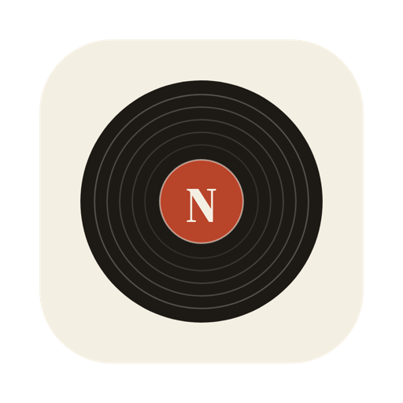
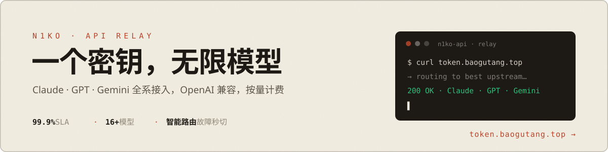
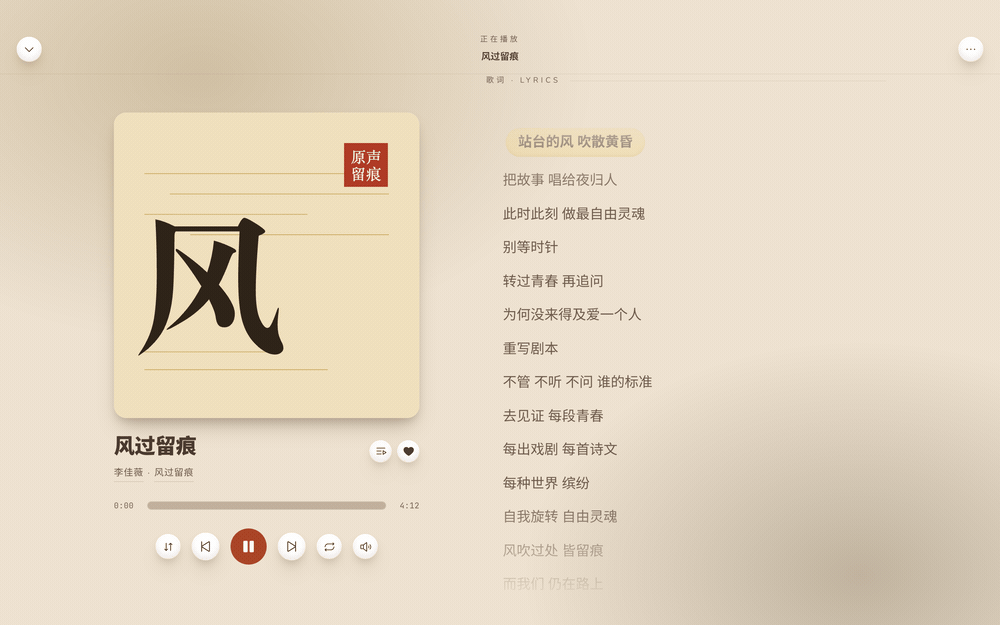
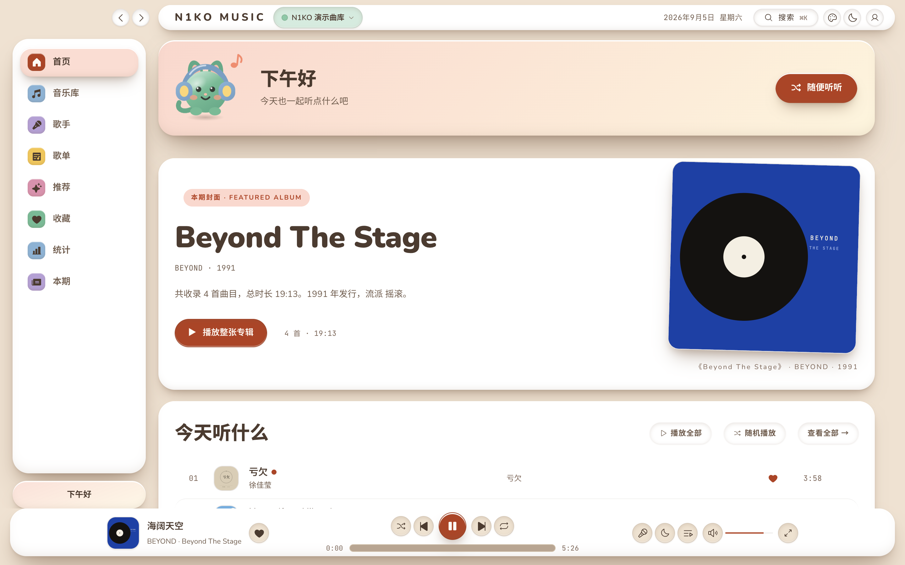
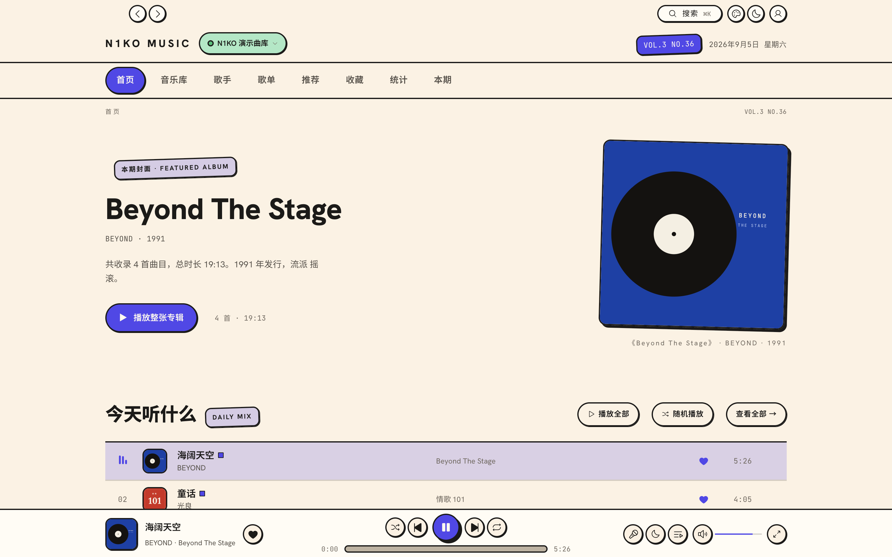
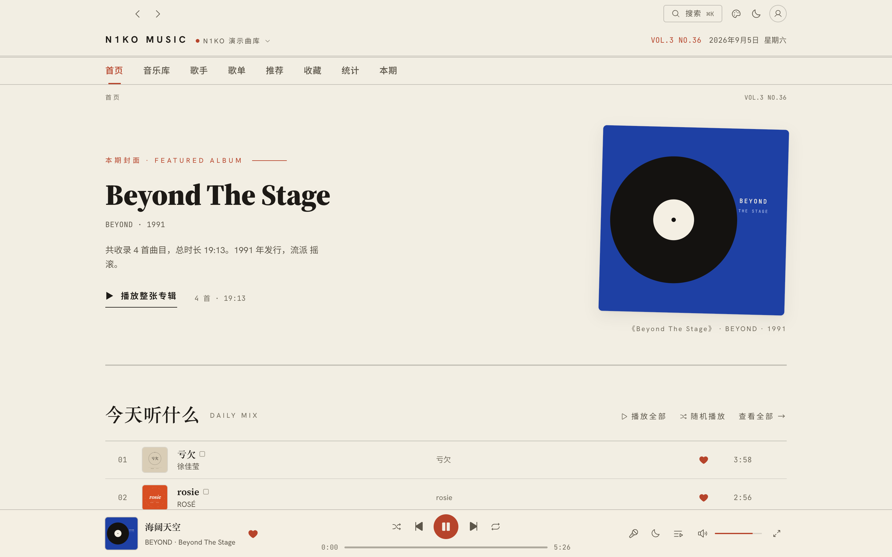
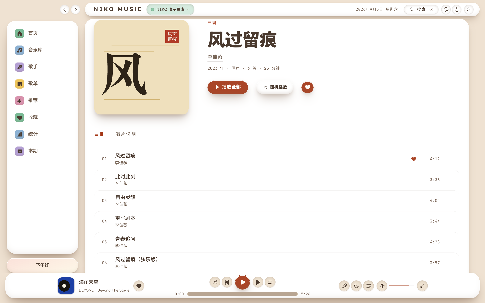
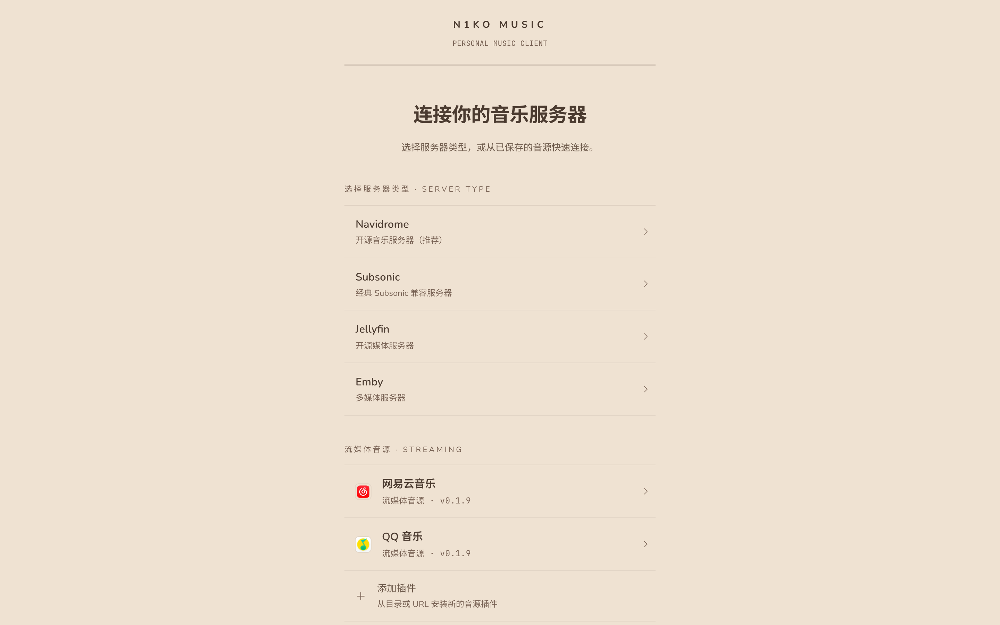
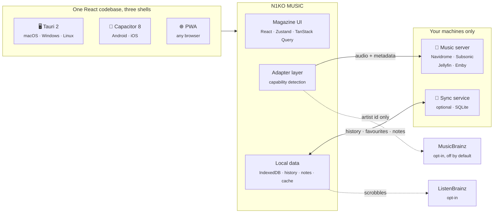

<div align="center">



# N1KO MUSIC

**A music magazine you can play**

Point it at Navidrome / Subsonic / Jellyfin / Emby and read your own library
like a beautifully typeset issue.
No NAS? Sign in with your own NetEase Cloud Music or QQ Music account and listen anyway.

<br/>

[](https://github.com/baogutang/N1KO-MUSIC/releases/latest)
[](https://github.com/baogutang/N1KO-MUSIC/stargazers)
[](LICENSE)
[](https://github.com/baogutang/N1KO-MUSIC/releases/latest)

<br/>

**[⬇ Download](https://github.com/baogutang/N1KO-MUSIC/releases/latest)** ·
**[English](README.md)** ·
**[中文](README_CN.md)** ·
**[Translate it](TRANSLATING.md)**

</div>

<br/>

## From the same author · N1KO-API

[](https://token.baogutang.top)

> If you build with AI, this one is for you: **[N1KO-API](https://token.baogutang.top)** — a
> subscription-to-API relay platform. One key for Claude, GPT and Gemini flagships, smart
> routing with instant failover, 99.9% SLA, transparent pay-as-you-go billing. Support QQ: 783246411.

<br/>

---

<div align="center">

### ✦ &nbsp; VOL. 3 &nbsp;·&nbsp; THE ARGUMENT &nbsp; ✦

</div>

Most music clients are admin dashboards with cover art bolted on. They are organised
around *what the server has* — tables, filters, counts.

A magazine is organised around *what is worth your attention this week*. It has a
masthead, an issue number, a cover story, running heads, and a colophon on the last
page. It has a voice.

N1KO MUSIC is built that way, all the way down:

|  | |
|---|---|
| **The structure is a magazine** | Masthead, issue number, cover story, running heads, colophon. That information architecture does not change with the looks — a skin changes the voice, not the skeleton. |
| **Artwork is the only colour** | Album covers are the sole large colour fields. Everything else is left to the skin's ground and strokes. |
| **Two skins, one click apart** | **Candy Pop Workshop** (default): cream ground, 2px ink strokes, hard shadows, everything a capsule, and every candy colour bound to a meaning (grape = now playing, mint = connected, lemon = starred, coral = error). **Paper & Ink**: warm paper `#f4efe3`, serif headlines, hairlines, one vermilion `#b8442a`. Both skins run the same components; switching flips a single attribute on `<html>`. |
| **Self-hosted type** | Source Serif 4 / Hanken Grotesk / JetBrains Mono — every duration, index and bitrate set in monospace. |
| **Nothing is invented** | Every generated sentence in the app — the editor's note, the rediscovery captions, the taste weights — is assembled from real numbers. When the data will not support a sentence, the sentence does not appear. |

Sound is not sacrificed to any of it: FLAC / WAV / ALAC passthrough, with 320 / 192 /
128kbps tiers for when bandwidth matters, and ReplayGain applied from the values your
server already computed.

Fully free, fully open source, no accounts, no telemetry, no upsell.

<br/>

## Interface

### Now playing

An oversized cover and a lyric stream with the current line picked out — tap any line to seek.
In Soft Clay the line sits on a cream-yellow pillow; in Candy Pop it is under a lemon highlighter;
in Paper & Ink it becomes a vermilion rule over a wash of colour lifted from the artwork.



### Home · the cover page

A featured-album headline, a numbered recently-added list, a typographic artist index,
and **Rediscover** — three columns pulled from your own history.

The same page in three skins. Cycle through them with the palette button in the toolbar,
or pick one from Settings · Appearance; each has its own light and dark.

**Soft Clay** · default

A pastel claymorphism dashboard: a full-height sidebar, a card grid, puffy buttons,
and a greeting banner that is home to **Nuo**, the mascot — headphones on while music
plays, a wave when it stops, and a hop and a line of small talk when you poke it in the sidebar.



**Candy Pop Workshop**



**Paper & Ink**



### Album · the dossier page

Oversized cover, archival metadata, a tracklist, liner notes, and a margin where you can
write your own.



### Connect your server — or sign in to a streaming source

Navidrome / Subsonic / Jellyfin / Emby connect in seconds;
NetEase Cloud Music / QQ Music sign in with a QR scan from the phone app.



<br/>

---

<div align="center">

### ✦ &nbsp; DEPARTMENTS &nbsp; ✦

</div>

### ♫ Playback

- **Real whole-library shuffle** — a random sample drawn from the server, not a reshuffle
  of the page you happen to have loaded. The queue panel shows the **actual play order**,
  and reshuffles cleanly on wrap instead of looping the same permutation forever.
- **Lossless passthrough** (FLAC / WAV / ALAC) plus 320 / 192 / 128kbps tiers, with
  **separate Wi-Fi and cellular settings** switched automatically — no more pulling
  original files over your home uplink while you are out. On iPhone this reads the
  system network state directly, because Safari does not expose it to web pages at all.
- **ReplayGain** applied from the gain your server already computed, so masters from
  different decades stop jumping in loudness.
- **The queue keeps going** — similar tracks append when it runs dry, and any song,
  artist or genre can seed a radio.
- **Continue listening** — long tracks you stopped halfway (a live set, a lecture, an
  audiobook) come back on the home page with the position you left, restored from the
  bookmark your server already holds. Anything you finished is not offered again.
- **Sleep timer** by duration or end-of-track, fading rather than cutting.
- **Cross-device resume** — start on the desktop, pick it up on the phone.
- **It tells you when it is buffering.** A big FLAC over a phone connection takes a
  moment; the play button breathes instead of claiming to be playing into silence.
- Gapless-ish preloading, fade on pause, 0.5–3× speed with pitch correction, long-track
  bookmarks for audiobooks and lectures.

### ⌘ Control

- **Multi-select and batch actions** on every list — ⌘/Ctrl-click, Shift-range, Esc to
  drop; long-press on touch. Play, queue, add to playlist, favourite, all at once.
- **Full Media Session integration**, which means it appears properly in **Windows SMTC,
  macOS Now Playing, Linux MPRIS**, and the Android/iOS lock screen — with a working
  scrubber, 1024px artwork, and **configurable buttons** (track skip for music, ±15s for
  audiobooks).
- **Headphone unplug pauses** instead of broadcasting to the room, and resumes when you
  plug back in within a minute.
- **Car mode** — 112–128px targets, swipe to change track, screen kept awake, still
  paper and ink.
- **`n1ko://` deep links** for Raycast, Alfred, Shortcuts, or a line in a note.
- **The tab tells you where you are** — page title follows the route, with the current
  track in front of it while something is playing.
- **Keyboard reaches the whole player** — space to play, ←/→ to seek ten seconds inside
  a track, ⌘←/⌘→ for tracks, ⌘↑/⌘↓ for volume in the same 5% steps the slider uses.
  Arrow keys stand down when a slider or menu has focus.
- ⌘K command palette, global shortcuts, alphabet rail on long lists, and scroll memory
  that restores where you were when you go back. Search and library tabs live in the URL,
  so Back really does bring your results back.

### ☰ Library

- Songs, albums, artists and playlists in one place, **virtualised** so a ten-thousand
  track library stays smooth.
- **Offline metadata cache** — cold starts show last time's library immediately and
  revalidate behind it. (Metadata only; no audio is stored.)
- **Liner notes**: personnel credits, album notes, ISRC, MusicBrainz pressing details.
- **Spec plate**: bit depth, sample rate, codec, channels, real bitrate.
- **Discography rail** — an artist's records read as a career down a hairline year rail,
  not a wall of covers.
- **Turn a queue into a playlist** — when shuffle stumbles onto a good run, keep it.
  Saved in the order you were hearing it, not the order it happens to sit in an array.
- **Edit playlists in place** — drag to reorder the queue, remove a track from a playlist
  without leaving the page.
- Multi-library servers, server-side rescan, star ratings, public share links, and
  "who else is listening" — all surfaced only when your server actually supports them.
  *Supported* means the server was asked and said yes: a Navidrome with sharing switched
  off simply has no share button, rather than one that fails when you press it.

### ✎ Yours

- **《本期》 / This Issue** — every month becomes an issue on its own: cover story,
  rankings, superlatives, first-heard. The editor's note is assembled from real numbers
  and invents nothing.
- **Rediscover** — *on this day*, *long unplayed*, *heard once*. What you already loved
  and are quietly losing.
- **Marginalia** — write your own note on any song, album or artist. It is the one thing
  here that cannot be recomputed from anything else, so it syncs and backs up first.
- **An editable taste profile** — see the literal weights the recommender scores with,
  and switch off any artist or genre for good. A hard filter, not a demotion.
- **Import your existing scrobbles** from ListenBrainz or Last.fm exports, so statistics
  and recommendations do not start from zero.
- **Export everything** — playlists as M3U8/XSPF, history as JSON/CSV. Generated in the
  browser, never uploaded.

### ⚙ Details that took the longest

- Thin spaces between CJK and Latin runs, hanging punctuation, slashed-zero tabular
  numerals.
- Credentials encrypted at rest with a non-extractable device key.
- A persistent offline banner with a retry action — not a toast that vanishes.
- `aria-pressed` on player toggles, WCAG AA text contrast, `motion-reduce` honoured.
- Issue numbers, running heads and a colophon on every page.

<br/>

---

<div align="center">

### ✦ &nbsp; HOW IT FITS TOGETHER &nbsp; ✦

</div>



Everything inside **Your machines only** is yours. The two dotted lines are the only
paths that can ever leave your network, both opt-in, and the MusicBrainz one is off
until you turn it on.

<br/>

## Supported servers

| Server | Status | Notes |
|--------|------|------|
| [Navidrome](https://www.navidrome.org/) | ✅ Recommended | Best experience, fully tested |
| [Subsonic](http://www.subsonic.org/) | ✅ Supported | Full Subsonic API compatibility |
| [Airsonic](https://airsonic.github.io/) / [Airsonic-Advanced](https://github.com/airsonic-advanced/airsonic-advanced) | ✅ Supported | Subsonic-compatible forks |
| [Jellyfin](https://jellyfin.org/) | ✅ Supported | Native API integration |
| [Emby](https://emby.media/) | ✅ Supported | Native API integration |

Optional server features — shares, ratings, bookmarks, multi-library, rescan, radio,
now-playing — are **detected, not assumed**. If your server does not implement one, the
entry does not appear at all rather than failing when tapped.

<details>
<summary>Related searches</summary>
<sub>Navidrome client · Navidrome desktop app · Subsonic client · Subsonic music player · Jellyfin music player · Emby music player · NAS music player · self-hosted music player · music streaming client · Airsonic client · NetEase Cloud Music desktop client · QQ Music desktop client</sub>
</details>

<br/>

## Streaming sources · NetEase Cloud Music / QQ Music

No NAS, or a song your NAS does not have? Sign in with your own account and listen —
**whatever your account is entitled to, and nothing more**. A track your subscription does
not cover is marked VIP with the reason spelled out; there is no "unlocking" of any kind.

| Source | Sign-in | What works |
|------|------|------|
| NetEase Cloud Music | QR scan from the phone app | Search, your playlists, favourites, daily picks, charts, lyrics, add to / remove from playlists |
| QQ Music | QR scan from the QQ app | Search, your playlists, favourites, radar picks, charts, lyrics |

They sit **alongside** your NAS rather than replacing it:

- **Search is grouped by source**, with an "All" view merged by relevance;
- the home page's **"What to play today"** interleaves each source's daily picks into one rail (the Recommendations page is its expanded form);
- favourites and playlists are sectioned by source, and the queue can mix them freely;
- an expired sign-in shows a banner asking you to scan again, instead of half the page quietly going blank.

**How it works.** Each source is a plugin ([protocol](docs/sources/PROTOCOL.md) — MusicFree-compatible, with `n1ko`
extensions such as QR sign-in) running in a scripts-only sandbox: it cannot touch the page or open
its own connections, and every request goes through the host, which enforces the manifest's host
allow-list on every redirect hop. The two stock plugins ship inside the installer and are ready on first launch.

**The boundary, stated plainly.** These endpoints are community reverse-engineering work, not official APIs —
a platform change can break them; we will follow along, but availability is not guaranteed. Credentials are
encrypted with the same AES-GCM key as your server passwords and never leave the device. The browser build
(Docker / static hosting) has no usable network channel for this, so streaming sources are offered in the
desktop and mobile apps only.

<br/>

## Download

Grab the installer for your platform from **[Releases](https://github.com/baogutang/N1KO-MUSIC/releases/latest)**:

| Platform | Package |
|------|--------|
| macOS (Apple Silicon) | `N1KO.MUSIC_x.x.x_aarch64.dmg` |
| macOS (Intel) | `N1KO.MUSIC_x.x.x_x64.dmg` |
| Windows | `N1KO.MUSIC_x.x.x_x64-setup.exe` / `.msi` |
| Linux | `.AppImage` / `.deb` |

**Mobile** (built by the [Mobile workflow](https://github.com/baogutang/N1KO-MUSIC/actions/workflows/mobile.yml), download from the latest run's Artifacts):

| Platform | Package | Notes |
|------|--------|------|
| Android | `N1KO-MUSIC-android-debug` → `app-debug.apk` | Debug build, installs directly (allow unknown sources) |
| iOS | `N1KO-MUSIC-ios-unsigned` → `.zip` | Unsigned; sideload with AltStore / Sideloadly |

> Release-signed mobile builds (Play keystore / Apple Developer) are not set up yet — the
> workflow slots them in without structural changes.
>
> On macOS, if you see "cannot verify the developer" on first launch, allow the app under
> System Settings → Privacy & Security.

<br/>

## Tech stack

| Layer | Technology |
|------|-----|
| Frontend | React 18 · TypeScript · Vite 5 · Tailwind CSS |
| UI | Radix UI · Phosphor Icons · self-hosted fonts (Source Serif 4 / Hanken Grotesk / JetBrains Mono / Nunito) |
| State and data | Zustand · TanStack Query v5 |
| Audio engine | Native HTML5 Audio |
| Streaming sources | Sandboxed plugins (MusicFree-compatible protocol + `n1ko` extensions); the host proxies network access through an allow-list |
| Desktop shell | Tauri 2 (Rust) |
| Mobile shell | Capacitor 8 (Android · iOS) |
| Optional sync service | Node.js 24 · Express · SQLite |
| i18n | Flat JSON catalogues, no runtime dependency ([contribute a language](TRANSLATING.md)) |

### Development

```bash
git clone https://github.com/baogutang/N1KO-MUSIC.git
cd N1KO-MUSIC/frontend
npm install
npm run dev          # web dev mode
npm run tauri:dev    # desktop dev mode
```

You do not need your own server to develop against: point the app at
`https://demo.navidrome.org` with username and password `demo`.

### Mobile (Android / iOS)

The same React frontend runs inside a Capacitor shell with native background playback and
lock-screen controls.

```bash
cd frontend
npm run cap:sync            # build web assets + sync native projects
npx cap open android        # requires Android Studio / SDK
npx cap open ios            # requires Xcode + CocoaPods
```

<details>
<summary><b>Optional sync service</b> — cross-device history, favourites and notes</summary>

<br/>

`backend/` exposes account, local-playlist, favourite, listening-history and marginalia
APIs. It is **entirely optional**: music always streams straight from your own music
server, and with no sync service configured the app keeps its full feature set, storing
everything locally in IndexedDB.

Once deployed, open **Settings › 跨设备同步 (SYNC)**, enter the address and sign in. The
client then mirrors history, favourites and notes, and merges records written by your
other devices, so recommendations do not restart on a new machine.

```bash
cd backend
npm ci
npm test
JWT_SECRET="replace-with-a-long-random-value" DATA_DIR=./data npm start
```

Docker deployments must mount `/app/data`; otherwise recreating the container loses both
the database and the generated JWT secret:

```bash
docker build -t n1ko-music-backend backend
docker run -d --name n1ko-music-backend \
  -p 3001:3001 \
  -v n1ko-music-data:/app/data \
  -e JWT_SECRET="replace-with-a-long-random-value" \
  n1ko-music-backend
```

Supported environment variables: `PORT`, `DATA_DIR`, `JWT_SECRET`, comma-separated
`FRONTEND_URLS`, `TRUST_PROXY_HOPS`, `RATE_LIMIT_MAX`, `AUTH_RATE_LIMIT_MAX`,
`ALLOW_REGISTRATION`, `LOGIN_ATTEMPT_MAX`, `LOGIN_ATTEMPT_WINDOW_MS`.

A consistent backup is taken in the data directory before any migration runs, and a test
asserts that a database upgraded from an old release converges — column for column, index
for index, constraint for constraint — with one created fresh today.

> **Registration policy (changed in v1.7.0)**: `ALLOW_REGISTRATION` defaults to
> `first-user` — open until the first account exists, then closed automatically. This
> matters as soon as the sync service is exposed to the internet. **Existing deployments
> adding a household member should set it to `open` temporarily**, or `closed` to lock it
> down entirely.
>
> **JWT secret**: leave `JWT_SECRET` unset and the service generates a 48-byte random key
> and persists it with mode 0600 — safer than picking one by hand. If you do set it, it
> must be at least 32 characters or the service refuses to start.

</details>

<details>
<summary><b>Web client via Docker</b> — if you would rather not install an app</summary>

<br/>

```bash
docker build -t n1ko-music-web frontend
docker run -d --name n1ko-music-web -p 8080:80 \
  -e DEFAULT_SERVER_URL=https://music.example.com \
  -e DEFAULT_SERVER_TYPE=navidrome \
  n1ko-music-web
```

</details>

<br/>

## Privacy, stated plainly

| What | Where it goes |
|---|---|
| Your music | Your music server. Nowhere else. |
| Listening history, statistics, taste profile | This device (IndexedDB), plus your own sync service if you run one. |
| Marginalia | Same. It is the only irreplaceable data here, so it syncs first. |
| Server credentials | Encrypted at rest with an AES-GCM key that page script cannot extract. |
| NetEase / QQ Music sign-in credentials | Same. Device-only; plugins run sandboxed and can only reach the hosts on their manifest allow-list. |
| Exports | Generated in the browser. Never uploaded. |
| ListenBrainz scrobbles | Only if you enter a token. Off by default. |
| MusicBrainz artist dossiers | Only the artist's MusicBrainz id, only if you switch it on. Off by default. |
| Telemetry, analytics, crash reporting | None. There is no server to send it to. |

<br/>

## Contributing

Pull requests welcome. Please read **[CONTRIBUTING.md](CONTRIBUTING.md)** first —
especially the design-contract section. This project has a deliberate visual stance (one
accent colour, no card stacking, Phosphor icons only), and colours always come from the
tokens in `frontend/src/index.css`.

Translating needs no React knowledge at all — see **[TRANSLATING.md](TRANSLATING.md)**.

<br/>

## Acknowledgements

N1KO MUSIC stands on the shoulders of these excellent projects:

- [StreamMusic](https://github.com/gitbobobo/StreamMusic) — a beautifully designed Flutter NAS music player whose UI and UX inspired this project
- [Navidrome](https://www.navidrome.org/) — the outstanding open-source Subsonic server
- [MusicBrainz](https://musicbrainz.org/) · [ListenBrainz](https://listenbrainz.org/) — open music data, no strings attached
- [Radix UI](https://www.radix-ui.com/) · [TanStack Query](https://tanstack.com/query) · [Zustand](https://github.com/pmndrs/zustand)

<br/>

## Star history

<a href="https://star-history.com/#baogutang/N1KO-MUSIC&Date">
 <picture>
   <source media="(prefers-color-scheme: dark)" srcset="https://api.star-history.com/svg?repos=baogutang/N1KO-MUSIC&type=Date&theme=dark" />
   <source media="(prefers-color-scheme: light)" srcset="https://api.star-history.com/svg?repos=baogutang/N1KO-MUSIC&type=Date" />
   
 </picture>
</a>

<br/>
<br/>

<div align="center">

<sub>N1KO MUSIC &nbsp;·&nbsp; Built by [N1KO](https://github.com/baogutang) &nbsp;·&nbsp; also check out **[N1KO-API](https://token.baogutang.top)**</sub>

If N1KO MUSIC is useful to you, a ⭐ means the world.

</div>
