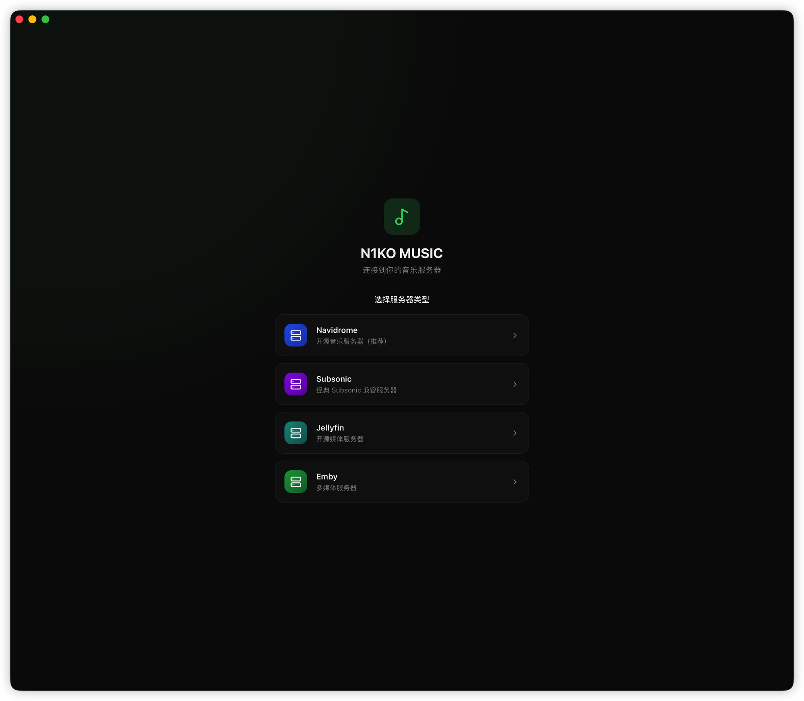
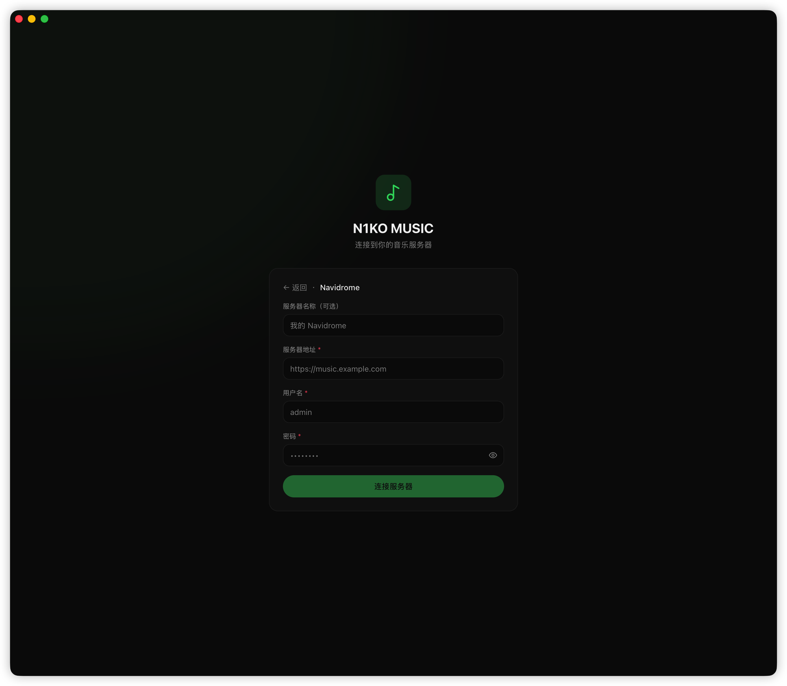
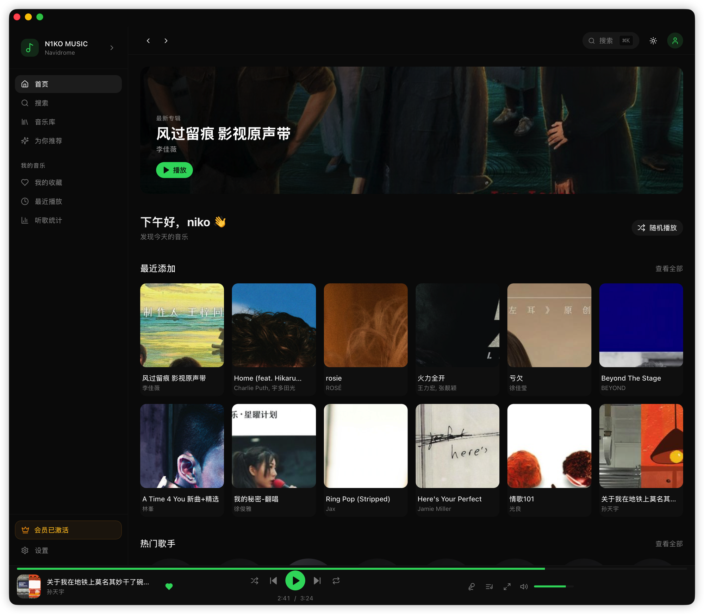
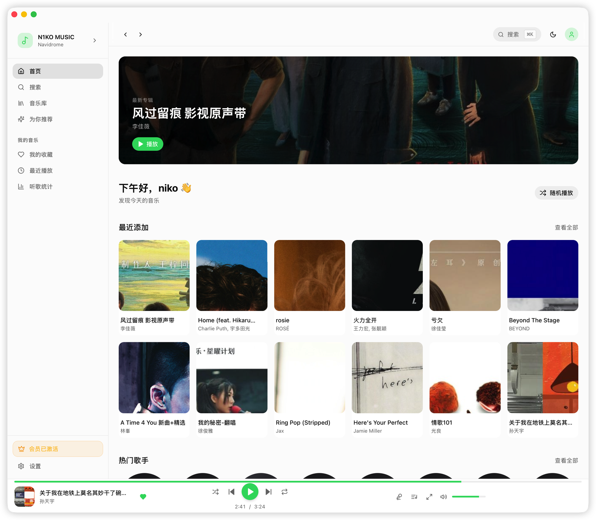
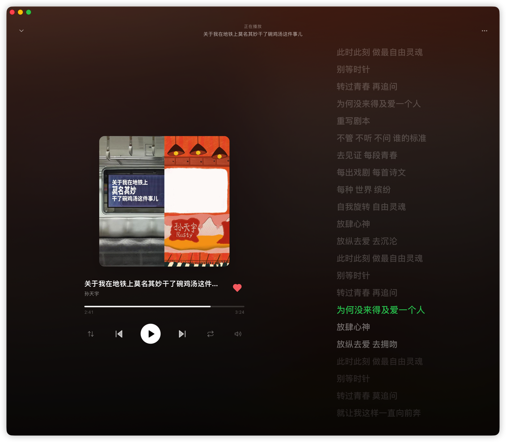
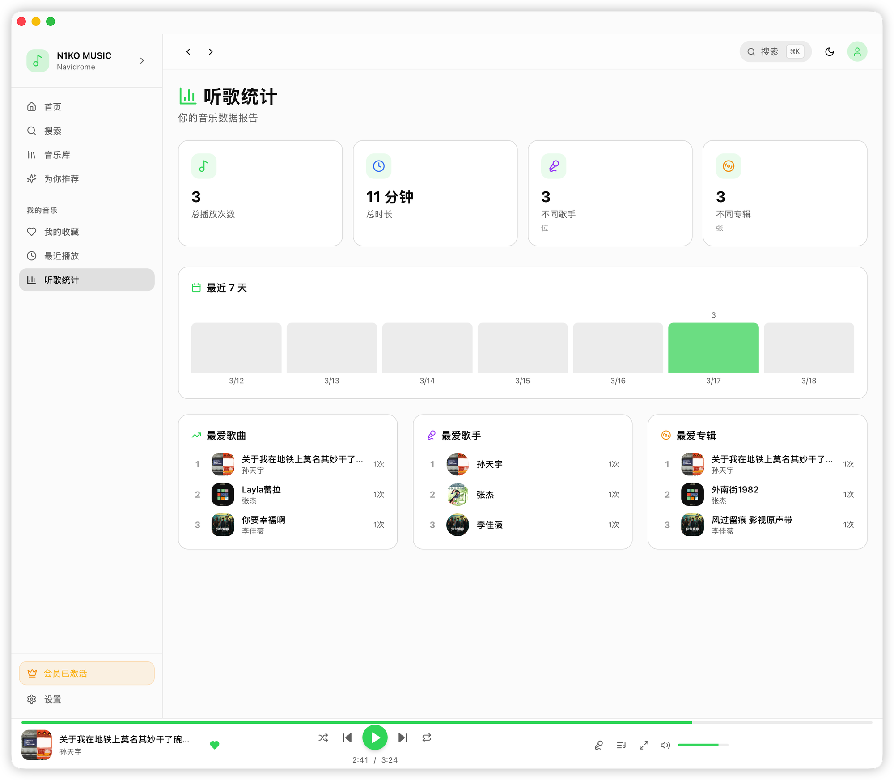
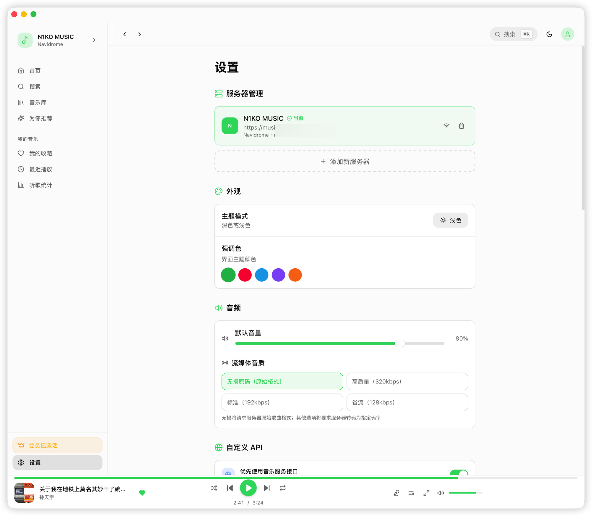

# N1KO MUSIC

### 一款支持 Navidrome / Subsonic / Jellyfin / Emby 的现代桌面音乐播放器

**这可能是你用过的最好用的 NAS 音乐播放器。**

**[English](README.md)** · **[中文](README_CN.md)**

---

## N1KO MUSIC 是什么？

N1KO MUSIC 是一款专为自建音乐服务器设计的**跨平台桌面音乐播放客户端**。支持连接 **Navidrome**、**Subsonic**、**Jellyfin** 和 **Emby** 服务器，把你的私人音乐库变成类 Spotify 的流媒体体验。

基于 **Tauri 2 + React + TypeScript** 构建，提供原生 macOS 桌面应用，支持 Hi-Fi 无损播放（FLAC/WAV/ALAC）、实时同步歌词、沉浸式全屏播放器。

> **在找 Navidrome 桌面客户端？Subsonic 音乐播放器？Jellyfin 或 Emby 音乐流媒体应用？**
> N1KO MUSIC 正是为此而生。

---

## 界面预览

### 连接服务器

支持 **Navidrome**、**Subsonic**、**Jellyfin**、**Emby** 四种主流音乐服务器，一键连接你的私人音乐库。

| 选择服务器 | 登录连接 |
|:---------:|:-------:|
|  |  |

### 首页

精美的首页设计，最新专辑推荐、最近添加、热门歌手一览无余。支持深色 / 浅色双主题。

| 深色模式 | 浅色模式 |
|:-------:|:-------:|
|  |  |

### 全屏播放器

沉浸式全屏播放体验，专辑封面动态模糊渐变背景，实时同步滚动歌词，支持点击歌词跳转。

### 听歌统计

你的音乐数据报告：总播放次数、总时长、最爱歌曲、最爱歌手、最爱专辑，一目了然。

### 设置

服务器管理、主题外观、音频质量（无损/高质量/标准/省流）、自定义 API 等丰富的设置选项。

---

## 核心功能

### 🎵 音乐体验
- **全屏播放器** — 专辑封面模糊渐变背景，实时同步歌词，流畅动画效果
- **智能歌词** — 实时滚动高亮，点击歌词跳转，支持自定义远程歌词接口
- **Hi-Fi 无损音质** — 支持无损（FLAC / WAV / ALAC）、高音质（320kbps）、省流多档可选
- **播放队列** — 随机 / 循环 / 单曲循环，拖拽排序，下一首插队

### 📚 音乐库与发现
- **音乐库** — 歌曲、专辑、歌手、歌单一体化浏览
- **为你推荐** — 基于你的音乐库随机发现好音乐
- **全局搜索** — 跨所有内容的全文搜索
- **最近播放** — 本地播放历史，精美时间轴展示
- **听歌统计** — 可视化数据：最常播放、活跃时段、最爱歌手

### 🎨 自定义 API 集成
- **自定义封面** — 用自己的 API 替换专辑封面（支持 `{artist}`、`{album}`、`{title}` 占位符）
- **自定义歌词** — 从任意外部来源获取歌词（URL 模板配置）
- **优先级控制** — 选择优先使用服务器数据还是自定义接口

### 🖥️ 桌面应用
- **macOS** — 原生窗口样式，Apple Silicon (arm64) + Intel (x64) 支持
- **深色 / 浅色主题** — 跟随系统或手动切换，多种强调色可选
- **基于 Tauri 2 构建** — 轻量快速，原生性能

---

## 兼容服务器

N1KO MUSIC 实现了 **Subsonic API** 协议，兼容以下主流音乐服务器：

| 服务器 | 状态 | 说明 |
|--------|------|------|
| [**Navidrome**](https://www.navidrome.org/) | ✅ 推荐 | 最佳体验，完整测试 |
| [**Subsonic**](http://www.subsonic.org/) | ✅ 支持 | 完整 Subsonic API 兼容 |
| [**Airsonic**](https://airsonic.github.io/) | ✅ 支持 | Subsonic 兼容分支 |
| [**Airsonic-Advanced**](https://github.com/airsonic-advanced/airsonic-advanced) | ✅ 支持 | Airsonic 增强版 |
| [**Jellyfin**](https://jellyfin.org/) | ✅ 支持 | 通过 Subsonic 插件 |
| [**Emby**](https://emby.media/) | ✅ 支持 | 原生支持 |

> **关键词：** Navidrome 客户端、Navidrome 桌面应用、Subsonic 客户端、Subsonic 音乐播放器、Jellyfin 音乐播放器、Emby 音乐播放器、NAS 音乐播放器、自建音乐播放器、音乐流媒体客户端、Airsonic 客户端

---

## 开通会员

N1KO MUSIC 的基础功能完全免费。开通会员可解锁以下高级功能：

- 🎶 **无损音质** — 解锁 FLAC / WAV / ALAC 原始格式播放
- ✨ **为你推荐** — 基于音乐库的智能推荐
- ❤️ **我的收藏** — 收藏喜欢的歌曲
- 📊 **听歌统计** — 详细的播放数据可视化报告

### 如何开通

1. 使用支付宝扫描下方收款码，转账 **¥59.9**（永久会员）
2. 转账时请在备注中留下你的 **支付宝账号** 或 **联系方式**
3. 支付完成后，通过支付宝联系收款方（Nikooh）获取 **激活码**
4. 在 N1KO MUSIC 客户端「设置」页面输入激活码即可激活

**支付宝扫码转账 · 联系获取激活码**

---

## 技术栈

| 模块 | 技术 |
|------|-----|
| 前端框架 | React 18, TypeScript, Vite 5 |
| UI 组件 | Radix UI, Tailwind CSS, shadcn/ui |
| 状态管理 | Zustand |
| 数据获取 | TanStack Query v5 |
| 音频引擎 | 原生 HTML5 Audio API |
| 桌面框架 | Tauri 2 (Rust) |
| 许可证后端 | Spring Boot 3, JPA, H2/MySQL |

---

## 鸣谢

N1KO MUSIC 的诞生离不开以下优秀开源项目的启发与支持，特此致谢：

- **[StreamMusic](https://github.com/gitbobobo/StreamMusic)** — 一款优秀的基于 Flutter 的移动端 NAS 音乐播放器，精良的 UI 设计和 UX 体验给了本项目很多灵感 🫡
- [Navidrome](https://www.navidrome.org/) — 出色的开源 Subsonic 服务端
- [Radix UI](https://www.radix-ui.com/) — 无样式、无障碍的 UI 基础组件
- [shadcn/ui](https://ui.shadcn.com/) — 精美的 React UI 组件库
- [TanStack Query](https://tanstack.com/query) — 强大的异步状态管理
- [Zustand](https://github.com/pmndrs/zustand) — 轻量高效的全局状态管理

---

## Star 趋势

<a href="https://star-history.com/#baogutang/N1KO-MUSIC&Date">
 <picture>
   <source media="(prefers-color-scheme: dark)" srcset="https://api.star-history.com/svg?repos=baogutang/N1KO-MUSIC&type=Date&theme=dark" />
   <source media="(prefers-color-scheme: light)" srcset="https://api.star-history.com/svg?repos=baogutang/N1KO-MUSIC&type=Date" />
   
 </picture>
</a>

---

用 ❤️ 打造，作者 [N1KO](https://github.com/baogutang)

如果 N1KO MUSIC 对你有帮助，请给个 ⭐ — 这对我来说意义非凡！

