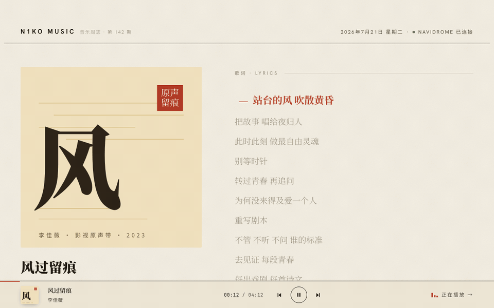
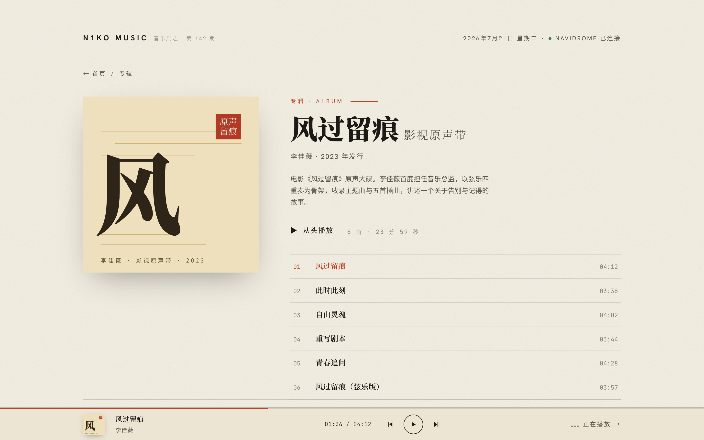
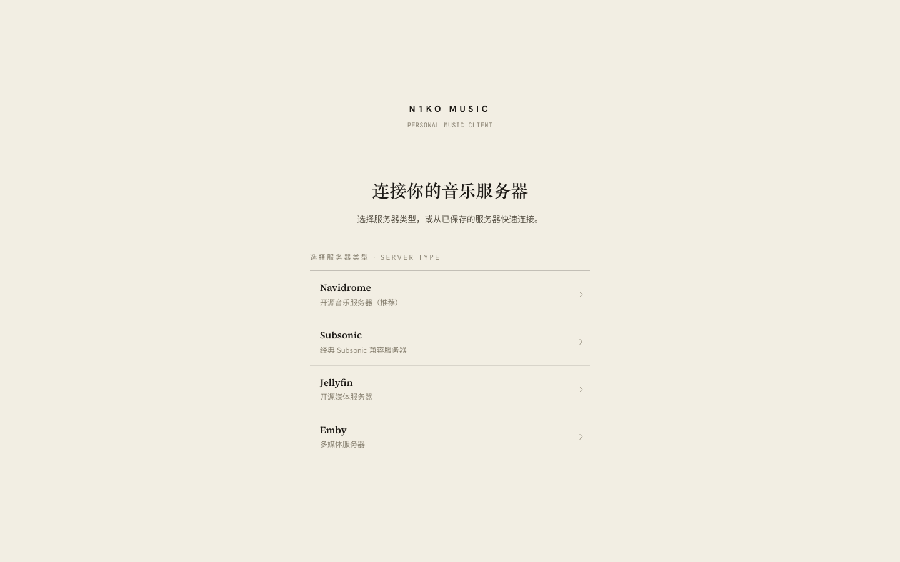
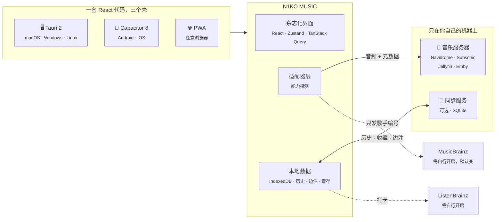

<div align="center">


# N1KO MUSIC

**一本可以播放的音乐杂志**

连上 Navidrome / Subsonic / Jellyfin / Emby，
把自己的曲库读成一本排好版的刊物。

<br/>

[](https://github.com/baogutang/N1KO-MUSIC/releases/latest)
[](https://github.com/baogutang/N1KO-MUSIC/stargazers)
[](LICENSE)
[](https://github.com/baogutang/N1KO-MUSIC/releases/latest)

<br/>

**[⬇ 下载](https://github.com/baogutang/N1KO-MUSIC/releases/latest)** ·
**[中文](README_CN.md)** ·
**[English](README.md)** ·
**[参与翻译](TRANSLATING.md)**

</div>

<br/>

## 同作者出品 · N1KO-API

[](https://token.baogutang.top)

> 如果你也在用 AI 做东西，这个可能用得上：**[N1KO-API](https://token.baogutang.top)** —— 订阅转 API 中转平台。
> 一个 key 打通 Claude / GPT / Gemini 旗舰模型，智能路由秒级切换，99.9% SLA，按量计费不玩虚的。技术支持 QQ：783246411。

<br/>

---

<div align="center">

### ✦ &nbsp; 第三卷 &nbsp;·&nbsp; 为什么是杂志 &nbsp; ✦

</div>

大多数音乐客户端是加了封面图的后台管理系统。它们按「服务器里有什么」组织：
表格、筛选器、计数。

而一本杂志按「这一期什么值得你看」组织。它有报头、有刊号、有封面故事、有书眉，
最后一页有版记。它有语气。

N1KO MUSIC 是照这个思路做到底的：

|  | |
|---|---|
| **排版即界面** | 不用卡片、不叠阴影、不用胶囊按钮。结构全部由字体、发丝线和留白承担。 |
| **封面是唯一的颜色** | 专辑封面是版面上唯一的大色块，其余一律保持纸的克制。 |
| **衬线的语气** | 自托管 Source Serif 4 / Hanken Grotesk / JetBrains Mono —— 音乐用衬线，数据用等宽。 |
| **纸·墨·朱** | 暖纸 `#f4efe3`、墨色文字、一种朱色 `#b8442a`。深色模式是同一种语气的夜间版，不是简单反色。 |
| **一个字都不编** | 应用里所有自动生成的句子——编者按、重听说明、口味权重——全部由真实数字拼成。数据撑不起某一句，那一句就不出现。 |

音质没有为此让步：FLAC / WAV / ALAC 原码直通，带宽紧张时有 320 / 192 / 128kbps 三档，
ReplayGain 直接用服务器已经算好的增益。

完全免费、完全开源，不需要账号，没有埋点，没有增值项。

<br/>

## 界面

### 正在播放

从封面取色、夹进纸面安全带的氛围光，衬线歌词流，当前行有朱色标记——点任意一行即可跳转。



### 首页 · 封面页

头条专辑、编号排列的最近添加、文字化的歌手索引，
以及**重听**——三栏全部来自你自己的收听记录。


### 专辑 · 档案页

超大封面、档案式元数据、发丝线曲目表、内页说明，
以及一块可以写你自己那句话的页边。



### 连接服务器

Navidrome / Subsonic / Jellyfin / Emby，几秒钟连上。



<br/>

---

<div align="center">

### ✦ &nbsp; 栏 目 &nbsp; ✦

</div>

### ♫ 播放

- **真正的全库随机**——从服务器抽样，而不是把当前加载的那一页重排一遍。队列面板显示的是
  **真实播放顺序**，走完一轮会重新洗牌，而不是永远循环同一个排列。
- **无损直通**（FLAC / WAV / ALAC）加 320 / 192 / 128kbps 三档，**Wi-Fi 与蜂窝分别设置**
  并自动切换——人在外面不会再把原始文件从家里的上行拽出来。
  iPhone 上直接读系统网络状态，因为 Safari 根本不把这个信息给网页。
- **ReplayGain** 用服务器已经算好的增益，不同年代的母带不再忽大忽小。
- **队列不会突然停**——放完自动接相似曲目，任何歌曲、歌手、曲风都能开一台电台。
- **继续听**——听到一半停下的长音轨（现场全集、讲座、有声书）会回到首页，
  带着你离开时的位置。断点取自服务器上早就写着的书签，换台设备也在。
  已经听完的不会再来烦你。
- **睡眠定时**，按时长或按本曲结束，渐弱而不是硬断。
- **跨设备续播**——桌面上听到一半，手机接着放。
- **它会告诉你正在缓冲。** 大文件走手机网络要等几秒，那几秒里播放键会轻轻呼吸，
  而不是摆出「正在播放」的样子对着一片死寂。
- 预加载逼近无缝、暂停渐弱、0.5–3 倍速带变调补偿，长音轨断点适合有声书和讲座。

### ⌘ 操作

- **每个列表都能多选批量操作**——⌘/Ctrl 点选、Shift 连选、Esc 退出；触摸端长按进入。
  播放、插队、加歌单、收藏，一次做完。
- **完整的 Media Session 集成**，因此它在 **Windows SMTC、macOS Now Playing、Linux MPRIS**
  以及安卓/iOS 锁屏上都是正常的——有能拖动的进度条、1024px 封面，
  按键还**可以自己配**（听歌用切歌，听书用 ±15 秒）。
- **拔耳机立刻暂停**，而不是把声音甩到外放；一分钟内插回来接着放。
- **车载模式**——112–128px 触控目标、滑动切歌、屏幕常亮，仍然是纸和墨。
- **`n1ko://` 深链接**，Raycast、Alfred、快捷指令，或者笔记里的一行。
- **键盘够得着整个播放器**——空格播放/暂停，←/→ 曲内快退快进 10 秒，
  ⌘←/⌘→ 上下一首，⌘↑/⌘↓ 调音量，步长和滑轨一致都是 5%。
  焦点落在滑轨或菜单上时，方向键让位给它们。
- ⌘K 命令面板、全局快捷键、长列表字母轨，以及**返回时回到原位**的滚动记忆。
  搜索词和曲库分页都存在地址栏里，所以「返回」真的能把结果带回来。

### ☰ 曲库

- 歌曲、专辑、歌手、歌单在一处，**虚拟滚动**，一万首也不卡。
- **离线元数据缓存**——冷启动先把上次的曲库摆出来，网络回来再悄悄替换。
  （只缓存元数据，不存任何音频。）
- **内页说明**：制作人员名录、唱片说明、ISRC、MusicBrainz 版本信息。
- **规格立牌**：位深、采样率、编码、声道、真实码率。
- **唱片目录年份轨**——一位歌手的作品读成一条生涯，而不是一片封面墙。
- **把队列存成歌单**——随机撞出一段好听的序列，就把它留下来。
  存的是你刚听到的那个顺序，不是它在数组里碰巧排成的样子。
- **歌单可以就地编辑**——队列拖拽排序，歌单里删歌不用离开当前页面。
- 多音乐库、服务端重扫、星级评分、公开分享链接、「还有谁在听」——
  全部只在你的服务器**确实支持**时才出现。这里的「支持」是**问过服务器、
  它说是**：一台关掉了分享的 Navidrome 上，分享入口整个不出现，
  而不是摆在那里等你点了才失败。

### ✎ 你自己的

- **《本期》**——每个月自动成为一期：封面故事、排行、本期之最、第一次听到的人。
  编者按由真实数字拼成，一个字不编。
- **重听**——*去年今日*、*久违*、*只听过一次*。你已经喜欢过、正在悄悄丢掉的那些。
- **边注**——给任何歌曲、专辑、歌手写一句自己的话。它是这里唯一不能被重新算出来的数据，
  因此优先同步、优先备份。
- **可改的口味画像**——推荐打分时真正在用的权重摊开给你看，任何歌手或曲风都能永久关掉。
  这是硬过滤，不是降权。
- **导入既有打卡历史**，ListenBrainz 或 Last.fm 的导出都认，统计和推荐不必从零开始。
- **一切都能导出**——歌单导出成 M3U8/XSPF，历史导出成 JSON/CSV，全部在浏览器里生成，
  不上传。

### ⚙ 最花时间的细节

- 中西文之间的细空格、标点悬挂、带斜杠的等宽数字。
- 服务器凭据用取不出来的设备密钥加密落盘。
- 离线时是一条带重试按钮的常驻横幅，不是一闪而过的 toast。
- 播放开关带 `aria-pressed`、文字对比度达 WCAG AA、尊重 `motion-reduce`。
- 每一页都有刊号、书眉和版记。

<br/>

---

<div align="center">

### ✦ &nbsp; 它 是 怎 么 搭 起 来 的 &nbsp; ✦

</div>


```mermaid
flowchart LR
    subgraph shells["一套 React 代码，三个壳"]
        direction TB
        D["🖥 Tauri 2<br/><sub>macOS · Windows · Linux</sub>"]
        M["📱 Capacitor 8<br/><sub>Android · iOS</sub>"]
        W["🌐 PWA<br/><sub>任意浏览器</sub>"]
    end

    subgraph app["N1KO MUSIC"]
        direction TB
        UI["杂志化界面<br/><sub>React · Zustand · TanStack Query</sub>"]
        AD["适配器层<br/><sub>能力探测</sub>"]
        LO["本地数据<br/><sub>IndexedDB · 历史 · 边注 · 缓存</sub>"]
    end

    subgraph yours["只在你自己的机器上"]
        direction TB
        S["🎵 音乐服务器<br/><sub>Navidrome · Subsonic<br/>Jellyfin · Emby</sub>"]
        B["🔄 同步服务<br/><sub>可选 · SQLite</sub>"]
    end

    shells --> app
    AD -->|"音频 + 元数据"| S
    LO <-->|"历史 · 收藏 · 边注"| B

    LB["ListenBrainz<br/><sub>需自行开启</sub>"]
    MB["MusicBrainz<br/><sub>需自行开启，默认关</sub>"]
    LO -.->|"打卡"| LB
    AD -.->|"只发歌手编号"| MB
```

**只在你自己的机器上**框里的一切都是你的。两条虚线是仅有的可能离开你网络的路径，
都需要你自己开，其中 MusicBrainz 那条默认关闭。

<br/>

## 支持的服务器

| 服务器 | 状态 | 说明 |
|--------|------|------|
| [Navidrome](https://www.navidrome.org/) | ✅ 推荐 | 体验最好，测试最充分 |
| [Subsonic](http://www.subsonic.org/) | ✅ 支持 | 完整兼容 Subsonic API |
| [Airsonic](https://airsonic.github.io/) / [Airsonic-Advanced](https://github.com/airsonic-advanced/airsonic-advanced) | ✅ 支持 | Subsonic 兼容分支 |
| [Jellyfin](https://jellyfin.org/) | ✅ 支持 | 原生 API 对接 |
| [Emby](https://emby.media/) | ✅ 支持 | 原生 API 对接 |

分享、评分、断点、多音乐库、重扫、电台、正在播放这些可选能力是**探测出来的，不是假设的**。
你的服务器没实现哪一项，那个入口就整个不出现，而不是点了报错。

<details>
<summary>相关搜索</summary>
<sub>Navidrome 客户端 · Navidrome 桌面版 · Subsonic 客户端 · Subsonic 音乐播放器 · Jellyfin 音乐播放器 · Emby 音乐播放器 · NAS 音乐播放器 · 自建音乐播放器 · 私有云音乐 · Airsonic 客户端</sub>
</details>

<br/>

## 下载

在 **[Releases](https://github.com/baogutang/N1KO-MUSIC/releases/latest)** 里挑你的平台：

| 平台 | 安装包 |
|------|--------|
| macOS（Apple 芯片） | `N1KO.MUSIC_x.x.x_aarch64.dmg` |
| macOS（Intel） | `N1KO.MUSIC_x.x.x_x64.dmg` |
| Windows | `N1KO.MUSIC_x.x.x_x64-setup.exe` / `.msi` |
| Linux | `.AppImage` / `.deb` |

**移动端**（由 [Mobile 工作流](https://github.com/baogutang/N1KO-MUSIC/actions/workflows/mobile.yml) 构建，在最近一次运行的 Artifacts 里下载）：

| 平台 | 包 | 说明 |
|------|--------|------|
| Android | `N1KO-MUSIC-android-debug` → `app-debug.apk` | Debug 包，可直接安装（需允许未知来源） |
| iOS | `N1KO-MUSIC-ios-unsigned` → `.zip` | 未签名，用 AltStore / Sideloadly 侧载 |

> 正式签名的移动端构建（Play keystore / Apple 开发者证书）还没配，工作流留好了位置，
> 补上时不需要改结构。
>
> macOS 首次打开若提示「无法验证开发者」，到「系统设置 → 隐私与安全性」里允许即可。

<br/>

## 技术栈

| 层 | 技术 |
|------|-----|
| 前端 | React 18 · TypeScript · Vite 5 · Tailwind CSS |
| UI | Radix UI · Phosphor Icons · 自托管字体（Source Serif 4 / Hanken Grotesk / JetBrains Mono） |
| 状态与数据 | Zustand · TanStack Query v5 |
| 音频引擎 | 原生 HTML5 Audio |
| 桌面壳 | Tauri 2（Rust） |
| 移动壳 | Capacitor 8（Android · iOS） |
| 可选同步服务 | Node.js 24 · Express · SQLite |
| 多语言 | 扁平 JSON 词条，零运行时依赖（[来贡献一种语言](TRANSLATING.md)） |

### 开发

```bash
git clone https://github.com/baogutang/N1KO-MUSIC.git
cd N1KO-MUSIC/frontend
npm install
npm run dev          # Web 开发模式
npm run tauri:dev    # 桌面开发模式
```

不需要自己有服务器：把地址填成 `https://demo.navidrome.org`，用户名密码都是 `demo`。

### 移动端（Android / iOS）

同一套 React 前端跑在 Capacitor 壳里，带原生后台播放与锁屏控制。

```bash
cd frontend
npm run cap:sync            # 构建 Web 产物并同步到原生工程
npx cap open android        # 需要 Android Studio / SDK
npx cap open ios            # 需要 Xcode + CocoaPods
```

<details>
<summary><b>可选同步服务</b> —— 跨设备的历史、收藏与边注</summary>

<br/>

`backend/` 提供账号、本地歌单、收藏、收听历史与边注接口。它**完全可选**：
音乐永远直接从你自己的音乐服务器流出，不配同步服务时功能一样完整，
数据全部存在本机 IndexedDB 里。

部署好之后打开 **设置 › 跨设备同步（SYNC）**，填地址登录即可。
客户端会把历史、收藏和边注镜像上去，并合并其它设备写入的记录，
换一台机器时推荐不必从零学起。

```bash
cd backend
npm ci
npm test
JWT_SECRET="换成一串足够长的随机值" DATA_DIR=./data npm start
```

Docker 部署必须挂载 `/app/data`，否则重建容器会同时丢掉数据库和自动生成的 JWT 密钥：

```bash
docker build -t n1ko-music-backend backend
docker run -d --name n1ko-music-backend \
  -p 3001:3001 \
  -v n1ko-music-data:/app/data \
  -e JWT_SECRET="换成一串足够长的随机值" \
  n1ko-music-backend
```

支持的环境变量：`PORT`、`DATA_DIR`、`JWT_SECRET`、逗号分隔的 `FRONTEND_URLS`、
`TRUST_PROXY_HOPS`、`RATE_LIMIT_MAX`、`AUTH_RATE_LIMIT_MAX`、`ALLOW_REGISTRATION`、
`LOGIN_ATTEMPT_MAX`、`LOGIN_ATTEMPT_WINDOW_MS`。

任何迁移执行前都会在数据目录里做一份一致性备份；并且有一个测试专门断言
「从老版本升级上来的库」与「今天全新建的库」逐列、逐索引、逐约束完全一致。

> **注册策略（v1.7.0 起变更）**：`ALLOW_REGISTRATION` 默认 `first-user`——
> 第一个账号建立之前开放，之后自动关闭。同步服务一旦暴露到公网，这条就很要紧。
> **已有部署要给家人加账号时，请临时改成 `open`**，或者用 `closed` 彻底锁死。
>
> **JWT 密钥**：不设 `JWT_SECRET` 时服务会自己生成 48 字节随机密钥并以 0600 落盘，
> 比手写一个更安全。如果要自己设，至少 32 个字符，否则服务拒绝启动。

</details>

<details>
<summary><b>Docker 版 Web 客户端</b> —— 不想装应用的话</summary>

<br/>

```bash
docker build -t n1ko-music-web frontend
docker run -d --name n1ko-music-web -p 8080:80 \
  -e DEFAULT_SERVER_URL=https://music.example.com \
  -e DEFAULT_SERVER_TYPE=navidrome \
  n1ko-music-web
```

</details>

<br/>

## 隐私，直接说清楚

| 什么 | 去了哪 |
|---|---|
| 你的音乐 | 你的音乐服务器。没有别处。 |
| 收听历史、统计、口味画像 | 这台设备（IndexedDB），以及你自己跑的同步服务（如果有）。 |
| 边注 | 同上。它是这里唯一无法重建的数据，所以优先同步。 |
| 服务器凭据 | 用页面脚本取不出来的 AES-GCM 密钥加密落盘。 |
| 导出的文件 | 在浏览器里生成，不上传。 |
| ListenBrainz 打卡 | 只有你填了 token 才发，默认关闭。 |
| MusicBrainz 歌手档案 | 只发歌手的 MusicBrainz 编号，且只有你打开开关才发，默认关闭。 |
| 埋点、统计、崩溃上报 | 没有。也没有可以发过去的服务器。 |

<br/>

## 参与

欢迎 PR。动手前请先读 **[CONTRIBUTING.md](CONTRIBUTING.md)**，尤其是设计契约那一节。
这个项目的视觉是有立场的（只有一种强调色、不叠卡片、只用 Phosphor 图标），
颜色一律取自 `frontend/src/index.css` 里的 token。

翻译完全不需要懂 React —— 见 **[TRANSLATING.md](TRANSLATING.md)**。

<br/>

## 致谢

N1KO MUSIC 站在这些优秀项目的肩膀上：

- [StreamMusic](https://github.com/gitbobobo/StreamMusic) —— 设计极其出色的 Flutter NAS 音乐播放器，本项目的 UI 与交互深受其启发
- [Navidrome](https://www.navidrome.org/) —— 出色的开源 Subsonic 服务端
- [MusicBrainz](https://musicbrainz.org/) · [ListenBrainz](https://listenbrainz.org/) —— 开放的音乐数据，不附加任何条件
- [Radix UI](https://www.radix-ui.com/) · [TanStack Query](https://tanstack.com/query) · [Zustand](https://github.com/pmndrs/zustand)

<br/>

## Star 趋势

<a href="https://star-history.com/#baogutang/N1KO-MUSIC&Date">
 <picture>
   <source media="(prefers-color-scheme: dark)" srcset="https://api.star-history.com/svg?repos=baogutang/N1KO-MUSIC&type=Date&theme=dark" />
   <source media="(prefers-color-scheme: light)" srcset="https://api.star-history.com/svg?repos=baogutang/N1KO-MUSIC&type=Date" />
   
 </picture>
</a>

<br/>
<br/>

<div align="center">

<sub>N1KO MUSIC &nbsp;·&nbsp; 由 [N1KO](https://github.com/baogutang) 打造 &nbsp;·&nbsp; 也欢迎看看 **[N1KO-API](https://token.baogutang.top)**</sub>

如果 N1KO MUSIC 对你有用，一颗 ⭐ 对我意义重大。

</div>
