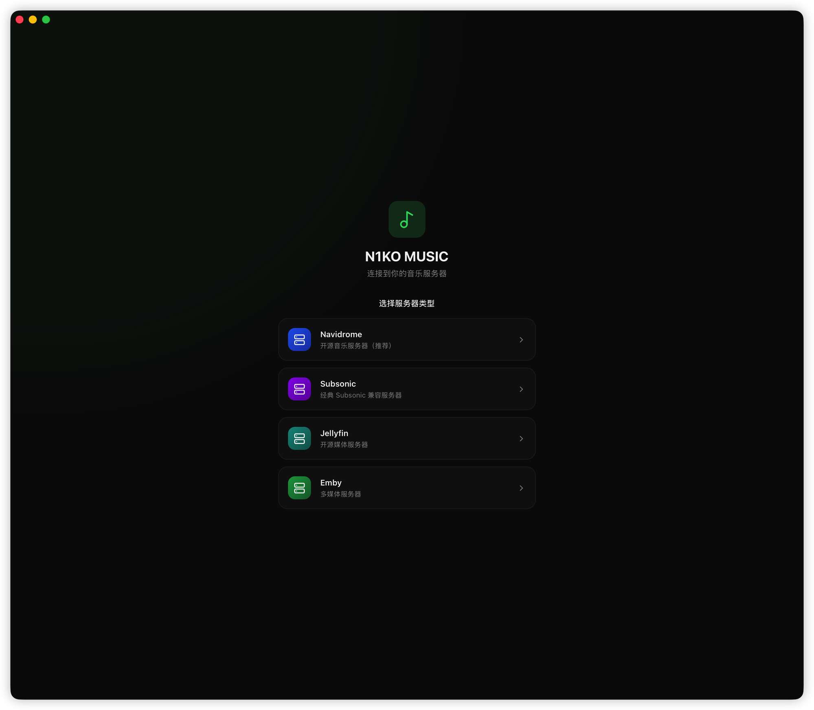
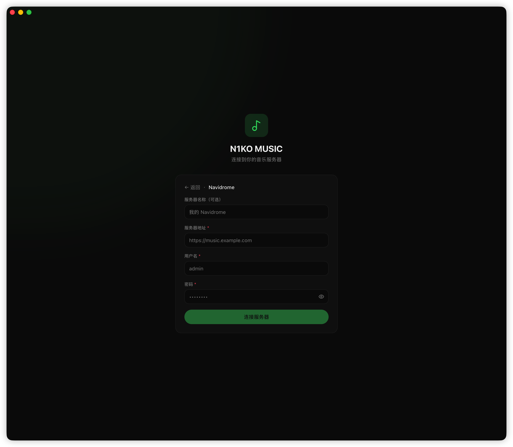
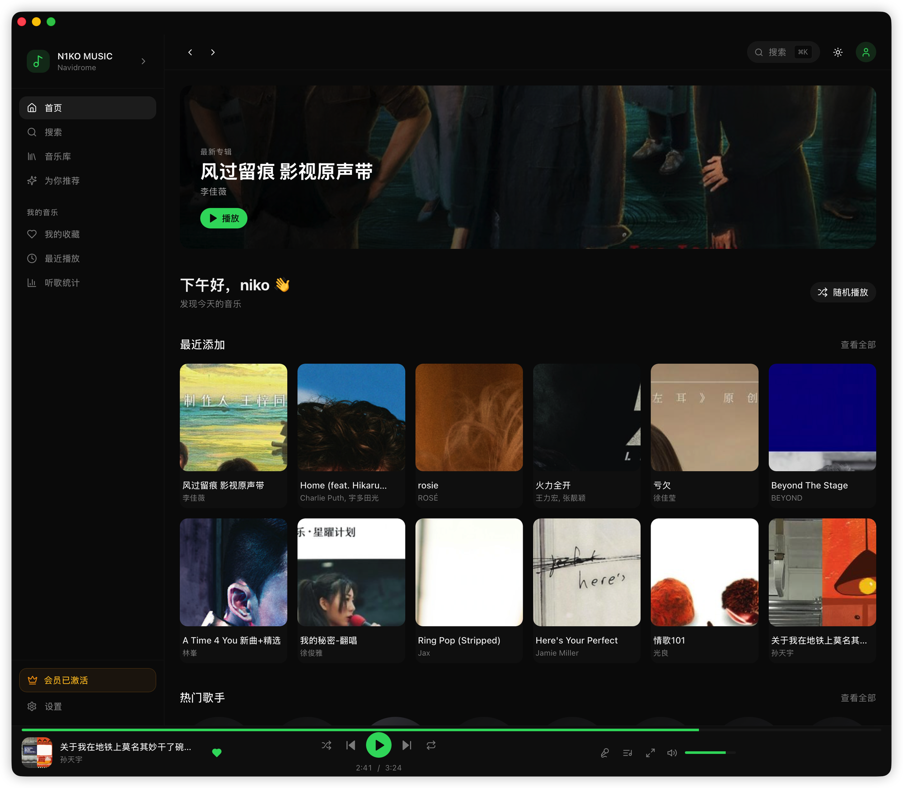
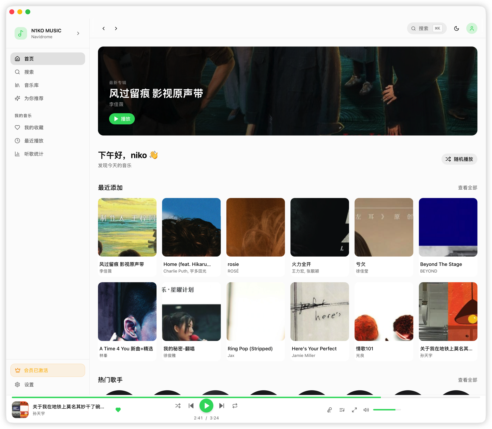
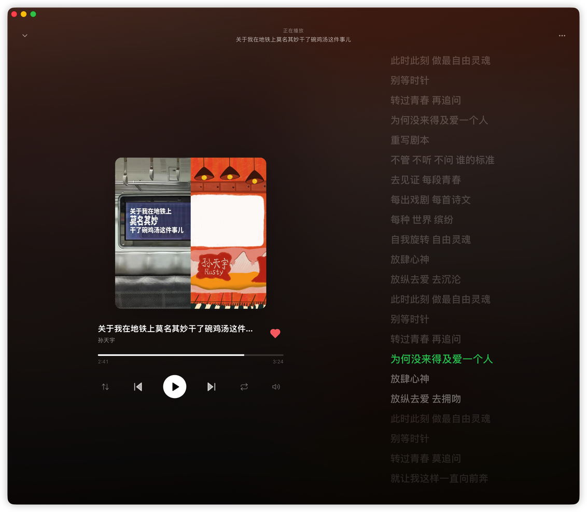
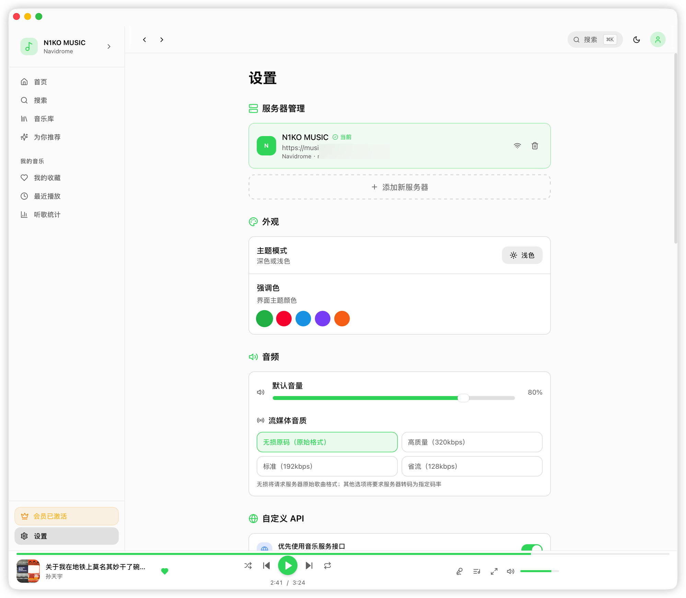

<div align="center">


# N1KO MUSIC

**为 NAS 而生的现代 Hi-Fi 音乐播放器**

连接 Navidrome / Subsonic / Jellyfin / Emby，把你的私人曲库变成一流的流媒体体验。

<br/>

[](https://github.com/baogutang/N1KO-MUSIC/releases/latest)
[](https://github.com/baogutang/N1KO-MUSIC/stargazers)
[](LICENSE)
[](https://github.com/baogutang/N1KO-MUSIC/releases/latest)

<br/>

**[⬇ 下载最新版](https://github.com/baogutang/N1KO-MUSIC/releases/latest)** · **[English](README.md)** · **[中文](README_CN.md)**

</div>

<br/>

## 设计哲学

N1KO MUSIC 不是又一个「能播歌的工具」。它以高端音响器材的审美打造：深墨画布、单一祖母绿强调色、等宽数字时间码、悬浮玻璃播放控制台，以及从专辑封面实时提取的氛围光。深浅双主题共享同一套设计语言，每一个界面都保持统一的克制与精确。

音质上，它支持 FLAC / WAV / ALAC 无损直通，也提供 320kbps 到 128kbps 的转码档位，让你在书房和地铁里都有合适的选择。

<br/>

## 界面预览

### 连接服务器

支持 Navidrome、Subsonic、Jellyfin、Emby 四种主流音乐服务器，一键连接你的私人音乐库。

| 选择服务器 | 登录连接 |
|:---------:|:-------:|
|  |  |

### 首页

最新专辑、最近添加、热门歌手一览无余，深浅双主题一键切换。

| 深色模式 | 浅色模式 |
|:-------:|:-------:|
|  |  |

### 全屏播放器

封面取色的沉浸式氛围背景，实时滚动歌词，点击任意一句即可跳转。



### 听歌统计

你的音乐数据报告：播放次数、总时长、最爱歌曲 / 歌手 / 专辑，一目了然。


### 设置

服务器管理、主题与强调色、音质档位、自定义封面与歌词接口。



<br/>

## 核心功能

**播放体验**

- 沉浸式全屏播放器，封面取色氛围背景与实时同步歌词
- 无损直通（FLAC / WAV / ALAC）与 320 / 192 / 128kbps 转码档位
- 完整播放队列：随机、循环、单曲循环、拖拽排序、下一首插队
- 全局键盘快捷键与系统媒体键（MediaSession）支持

**音乐库与发现**

- 歌曲、专辑、歌手、歌单一体化浏览，无限滚动加载
- 跨全库的即时搜索，为你推荐随机发现
- 本地播放历史与可视化听歌统计
- 播放行为按真实收听时长上报服务器（兼容 Last.fm Scrobble）

**自定义接口**

- 自定义封面与歌词 API，支持 `{artist}` / `{album}` / `{title}` 占位符
- 服务器数据与自定义接口的优先级可控

**桌面应用**

- macOS（Apple Silicon + Intel）、Windows、Linux 三平台原生构建
- 深浅主题跟随系统，五种强调色预设
- 基于 Tauri 2，安装包轻量、内存占用远低于 Electron

<br/>

## 兼容服务器

| 服务器 | 状态 | 说明 |
|--------|------|------|
| [Navidrome](https://www.navidrome.org/) | ✅ 推荐 | 最佳体验，完整测试 |
| [Subsonic](http://www.subsonic.org/) | ✅ 支持 | 完整 Subsonic API 兼容 |
| [Airsonic](https://airsonic.github.io/) / [Airsonic-Advanced](https://github.com/airsonic-advanced/airsonic-advanced) | ✅ 支持 | Subsonic 兼容分支 |
| [Jellyfin](https://jellyfin.org/) | ✅ 支持 | 原生 API 接入 |
| [Emby](https://emby.media/) | ✅ 支持 | 原生 API 接入 |

<details>
<summary>相关搜索</summary>
<sub>Navidrome 客户端 · Navidrome 桌面应用 · Subsonic 客户端 · Subsonic 音乐播放器 · Jellyfin 音乐播放器 · Emby 音乐播放器 · NAS 音乐播放器 · 自建音乐播放器 · 音乐流媒体客户端 · Airsonic 客户端</sub>
</details>

<br/>

## 下载安装

前往 **[Releases](https://github.com/baogutang/N1KO-MUSIC/releases/latest)** 页面下载对应平台的安装包：

| 平台 | 安装包 |
|------|--------|
| macOS (Apple Silicon) | `N1KO.MUSIC_x.x.x_aarch64.dmg` |
| macOS (Intel) | `N1KO.MUSIC_x.x.x_x64.dmg` |
| Windows | `N1KO.MUSIC_x.x.x_x64-setup.exe` / `.msi` |
| Linux | `.AppImage` / `.deb` |

> macOS 首次打开如提示「无法验证开发者」，请在「系统设置 → 隐私与安全性」中允许打开。

<br/>

## 开通会员

N1KO MUSIC 的基础功能完全免费。开通会员可解锁：**无损音质**、**为你推荐**、**我的收藏**、**听歌统计**。

1. 使用支付宝扫描下方收款码，转账 **¥59.9**（永久会员）
2. 转账时在备注中留下你的 **支付宝账号** 或 **联系方式**
3. 支付完成后通过支付宝联系收款方（Nikooh）获取 **激活码**
4. 在客户端「设置」页输入激活码即可激活

<div align="center">


<sub>支付宝扫码转账 · 联系获取激活码</sub>

</div>

<br/>

## 技术栈

| 模块 | 技术 |
|------|-----|
| 前端 | React 18 · TypeScript · Vite 5 · Tailwind CSS |
| UI | Radix UI · shadcn/ui · Phosphor Icons |
| 状态与数据 | Zustand · TanStack Query v5 |
| 音频引擎 | 原生 HTML5 Audio |
| 桌面框架 | Tauri 2 (Rust) |
| 数据后端 | Node.js (Express) · SQLite |
| 许可证后端 | Spring Boot 3 · JPA · H2/MySQL |

### 本地开发

```bash
git clone https://github.com/baogutang/N1KO-MUSIC.git
cd N1KO-MUSIC/frontend
npm install
npm run dev          # Web 开发模式
npm run tauri:dev    # 桌面应用开发模式
```

<br/>

## 鸣谢

N1KO MUSIC 的诞生离不开以下优秀开源项目的启发与支持：

- [StreamMusic](https://github.com/gitbobobo/StreamMusic) 一款优秀的 Flutter 移动端 NAS 音乐播放器，精良的 UI 与 UX 给了本项目很多灵感
- [Navidrome](https://www.navidrome.org/) 出色的开源 Subsonic 服务端
- [Radix UI](https://www.radix-ui.com/) · [shadcn/ui](https://ui.shadcn.com/) · [TanStack Query](https://tanstack.com/query) · [Zustand](https://github.com/pmndrs/zustand)

<br/>

## Star 趋势

<a href="https://star-history.com/#baogutang/N1KO-MUSIC&Date">
 <picture>
   <source media="(prefers-color-scheme: dark)" srcset="https://api.star-history.com/svg?repos=baogutang/N1KO-MUSIC&type=Date&theme=dark" />
   <source media="(prefers-color-scheme: light)" srcset="https://api.star-history.com/svg?repos=baogutang/N1KO-MUSIC&type=Date" />
   
 </picture>
</a>

<br/>
<br/>

<div align="center">

由 [N1KO](https://github.com/baogutang) 打造

如果 N1KO MUSIC 对你有帮助，请点一个 ⭐，这对我意义非凡。

</div>
